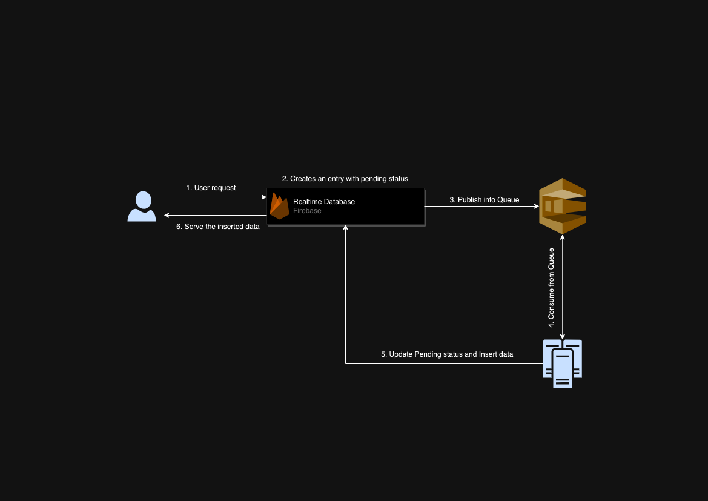

# GPT Wrapper Design Documentation

## Overview

This document outlines the high-level design of the GPT Wrapper system. The GPT Wrapper system is designed to efficiently process user requests using a GPT model by leveraging a combination of Firebase Realtime Database for initial request tracking, a queue system (Amazon SQS or Redis-Queue) for managing the request processing, and a server running the GPT model or using a GPT API for completions. This architecture ensures scalability, reliability, and real-time response to user requests.

## System Flow

The flow of operations in the GPT Wrapper system is as follows:

1. **User Request Initiation**: A user initiates a request through an interface that interacts with the system.
2. **Firebase Realtime Database Entry**: The request is logged into the Firebase Realtime Database with a status of `pending`. This entry includes all necessary data for processing the request.
3. **Queue Insertion**: Simultaneously, the request data is added to a queue for processing. This can be either Amazon SQS or Redis-Queue, depending on the system's configuration.
4. **Request Processing**: A server dedicated to running the GPT model (or utilizing a GPT API) consumes the request from the queue. It processes the request by generating the required completions.
5. **Database Update**: Once the request is processed, the system updates the Firebase Realtime Database with the completion data and changes the request's status to `completed`.
6. **User Notification and Data Retrieval**: The user is notified that their request has been processed, and they can retrieve the completed data from the system.

## Diagram

This diagram illustrates the described system flow, providing a visual representation of how each component interacts within the GPT Wrapper system.

## Components

- **Firebase Realtime Database**: Used for initial request tracking and status updates.
- **Queue System (Amazon SQS/Redis-Queue)**: Manages the processing of user requests in a scalable and efficient manner.
- **Server (GPT Model/GPT API)**: Processes the requests by generating completions based on the input data.
- **User Interface**: Allows users to submit requests and view the completed data once processed.

## Conclusion

The GPT Wrapper system is designed to provide a scalable, efficient, and real-time solution for processing user requests with GPT models. By leveraging modern technologies such as Firebase, Amazon SQS/Redis-Queue, and GPT APIs, the system ensures high performance and reliability for users.

